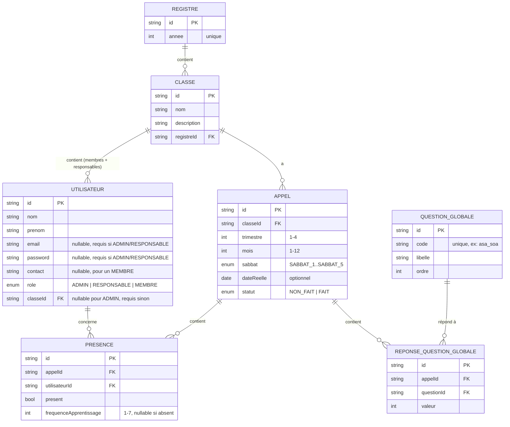

# Modèle de données

> **v2** : suite à une précision métier, `Membre` et `User` sont fusionnés en
> une seule entité `Utilisateur`. Un responsable de classe n'a qu'**une
> seule** classe (la sienne), et apparaît dans la liste de présence de sa
> propre classe au même titre qu'un membre simple.

## 1. Diagramme entité-relation (Mermaid)



## 2. Règles métier clés

- **Utilisateur unique** : `ADMIN`, `RESPONSABLE` et `MEMBRE` sont le même
  modèle, distingués par `role`. Plus de table `Membre` séparée.
- **1 Utilisateur (Responsable ou Membre) = 1 Classe.** Champ `classeId`
  direct sur `Utilisateur`, nullable uniquement pour `ADMIN`.
- **1 Classe = plusieurs Responsables possibles.** Simple filtre
  `WHERE classeId = X AND role = RESPONSABLE` — pas besoin de table de
  jointure.
- **Le responsable est dans la liste de présence de sa classe.** L'appel
  liste tous les `Utilisateur` de la classe (`role IN (RESPONSABLE, MEMBRE)`),
  sans distinction pour le pointage présence/fréquence d'étude.
- **Login conditionnel** : `email`/`password` obligatoires seulement pour
  `ADMIN` et `RESPONSABLE` (contrainte applicative, pas uniquement base de
  données — validation faite au niveau du service NestJS).
- **1 Registre = 1 année**, contrainte unique sur `Registre.annee`.
- **Classes non dupliquées** d'une année à l'autre : chaque nouveau Registre
  démarre avec une liste de classes vide, à recréer manuellement — et donc
  les utilisateurs (membres/responsables) sont ré-affectés manuellement
  chaque année à leur nouvelle classe.
- **Questions globales gérables** : table `QuestionGlobale` avec CRUD complet
  accessible à l'Admin. Un seed initial fournit les questions de départ. La
  suppression d'une question cascade sur ses `ReponseQuestionGlobale`.
- **Fréquence d'apprentissage nullable** : `frequenceApprentissage` vaut
  `null` quand le membre est absent (jamais `0`) ; la valeur `null` est
  explicitement exclue des calculs de taux au dashboard.
- **Unicité d'un Appel** : contrainte unique `(classeId, trimestre, mois,
  sabbat)` — un seul appel par classe/trimestre/mois/sabbat. La création
  d'un doublon est **bloquée** (erreur applicative avec l'id de l'appel
  existant retourné), pas de fusion automatique.
- **Correction vs recommencer à zéro** : une erreur de saisie se corrige en
  modifiant le contenu de l'appel existant (présences, réponses). Pour
  recommencer intégralement, l'appel doit être **supprimé** (cascade sur
  `Presence` et `ReponseQuestionGlobale` via `onDelete: Cascade`) avant
  d'en recréer un nouveau pour la même combinaison.
- **Sabbat 5** : n'est proposé au select que si le mois sélectionné compte
  effectivement 5 samedis (endpoint utilitaire `GET
  /calendrier/sabbats?annee=&mois=`).

## 3. Schéma Prisma (implémenté)

```prisma
generator client {
  provider = "prisma-client-js"
}

datasource db {
  provider = "postgresql"
  url      = env("DATABASE_URL")
}

enum Role {
  ADMIN
  RESPONSABLE
  MEMBRE
}

enum Sabbat {
  SABBAT_1
  SABBAT_2
  SABBAT_3
  SABBAT_4
  SABBAT_5
}

enum StatutAppel {
  NON_FAIT
  FAIT
}

model Registre {
  id        String   @id @default(uuid())
  annee     Int      @unique
  classes   Classe[]
  createdAt DateTime @default(now())
}

model Classe {
  id            String        @id @default(uuid())
  nom           String
  description   String?
  registre      Registre      @relation(fields: [registreId], references: [id])
  registreId    String
  utilisateurs  Utilisateur[]
  appels        Appel[]
  createdAt     DateTime      @default(now())

  @@unique([nom, registreId])
}

model Utilisateur {
  id         String     @id @default(uuid())
  nom        String
  prenom     String
  email      String?    @unique   // requis si role ADMIN ou RESPONSABLE
  password   String?              // requis si role ADMIN ou RESPONSABLE
  contact    String?              // optionnel, surtout utile pour un MEMBRE
  role       Role
  classe     Classe?    @relation(fields: [classeId], references: [id])
  classeId   String?              // null uniquement pour ADMIN
  presences  Presence[]
  createdAt  DateTime   @default(now())
  updatedAt  DateTime   @updatedAt
}

model Appel {
  id         String                    @id @default(uuid())
  classe     Classe                    @relation(fields: [classeId], references: [id])
  classeId   String
  trimestre  Int
  mois       Int
  sabbat     Sabbat
  dateReelle DateTime?
  statut     StatutAppel               @default(NON_FAIT)
  presences  Presence[]
  reponses   ReponseQuestionGlobale[]
  createdAt  DateTime                  @default(now())
  updatedAt  DateTime                  @updatedAt

  @@unique([classeId, trimestre, mois, sabbat])
}

model Presence {
  id                      String       @id @default(uuid())
  appel                   Appel        @relation(fields: [appelId], references: [id], onDelete: Cascade)
  appelId                 String
  utilisateur             Utilisateur  @relation(fields: [utilisateurId], references: [id])
  utilisateurId           String
  present                 Boolean      @default(false)
  frequenceApprentissage  Int?         // 1 à 7, null si absent (jamais 0)

  @@unique([appelId, utilisateurId])
}

model QuestionGlobale {
  id        String                    @id @default(uuid())
  code      String                    @unique
  libelle   String
  ordre     Int                       @default(0)
  reponses  ReponseQuestionGlobale[]
}

model ReponseQuestionGlobale {
  id          String           @id @default(uuid())
  appel       Appel            @relation(fields: [appelId], references: [id], onDelete: Cascade)
  appelId     String
  question    QuestionGlobale  @relation(fields: [questionId], references: [id])
  questionId  String
  valeur      Int              @default(0)

  @@unique([appelId, questionId])
}
```

> **Validation applicative côté NestJS** : un service/DTO vérifie que
> `email`/`password` sont fournis quand `role` est `ADMIN` ou `RESPONSABLE`,
> et que `classeId` est fourni quand `role` est `RESPONSABLE` ou `MEMBRE`
> (mais absent/null pour `ADMIN`). Prisma seul ne peut pas exprimer cette
> contrainte conditionnelle.

## 4. Données de seed (initiales)

`QuestionGlobale` (liste de départ, modifiable via l'interface Admin après le seed) :

| code | libellé |
|---|---|
| `asa_soa` | Firy ny nanao asa soa |
| `conference_biblique` | Firy ny nanao conférence ara-baiboly |
| `partage_fanapiana` | Firy no nizara fanapiana |
| `mpiara_mivavaka` | Firy ny mpiara-mivavaka |
| `mpianatra_baiboly` | Firy ny mpianatra Baiboly |

Un utilisateur `ADMIN` de base est aussi prévu au seed (compte initial
pour se connecter la première fois).
